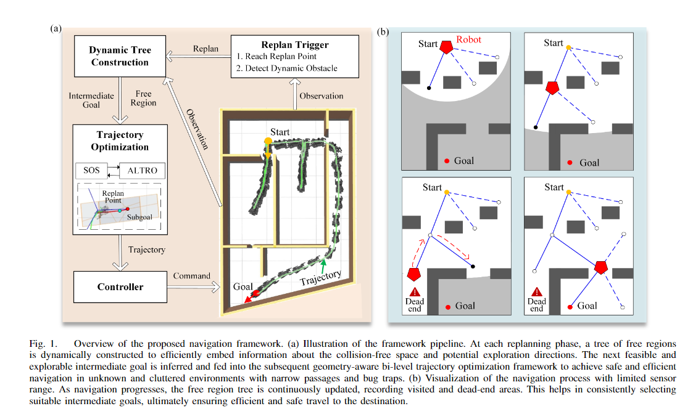

# FRTree Planner
<p align ="center">

</p>

FRTree planner is a robot navigation framework featuring a **Tree** of **F**ree **R**egion specifically designed for cluttered and unknown environments with narrow passages. 
The framework continuously incorporates real-time perceptive information to expand the tree toward explorable and traversable directions, with their geometric structure embedded in the sequence of extracted free regions. This dynamically constructed tree efficiently encodes the connectivity information of the free space, allowing the robot to select the most viable intermediate goals, navigate around dead-end situations, and avoid dynamic obstacles without relying on a prior map. 
Crucially, by examining the geometric relationship between the free regions and the robot along the tree, the framework can identify narrow passages that are suitable for the robot's specific geometry. By integrating this tree information with backend trajectory optimization, the framework generates robust and adaptable obstacle avoidance behaviors to navigate through narrow passages.
Through extensive simulations and real-world experiments, our framework demonstrates its advantages over benchmark methods in generating safe, efficient motion plans, enabling the robot to navigate effectively through highly cluttered and unknown terrains with narrow gaps.

## Example
<p align ="center">

### Maze 


---

### Forest 
Navigate from different start to goal in three area with different obstacle densities: Sparse Area (0.4 obstacle/m<sup>2</sup>): from S1 to G1; Moderately Dense Area (0.7 obstacle/m<sup>2</sup>): from S2 to G2; Dense Area (1.0 obstacle/m<sup>2</sup>): from S3 to G3.


---

### Different Shapes in Clutterd Forest
Navigate from different start to goal with different shape of the robot.


---

### Navigation in 3D Environments

Navigate from different start to goal in 3D Environment.


---

### Real World 


---

</p>

## Usage
``local_map``manage the update of the tree; 

``planner_manage`` has a FSM to manage the pipeline of the framework (including the intermediate goal selecting and dynamic obstacle detection); 

``Altro`` and ``SDPsolver`` solve the backend trajectory optimization problem.

A detailed matlab demo for constructing/solving the SOS programming as well as extracting the gradient information is provided in [scaling SDP](https://github.com/lyl00/minimum_scaling_free_region).

### Step 1: build the planner.
You need to :
- install the conic programming solver [COPT](https://guide.coap.online/copt/en-doc/intro.html) and get a license.
- install the numerical optimization library [ALTRO](https://github.com/RoboticExplorationLab/ALTRO) to system using default path.
- sudo apt install whatever you miss in your system.

Then you can build the catkin workspace with:
```sh
catkin build pop_planner
source devel/setup.bash
```

### Step 2 Start the planner
1. the planner takes three input topics:
- ``/odom`` (odometry information of your robot)
- ``/velodyne_points`` (the raw point cloud data)
- ``/move_base_simple/goal`` (2D navigation goal in rviz)

and output directly the ``/cmd_vel`` which is a ``geometry_msgs::Twist`` message for a full-directional mobile robot. You need to take care of your robot model and the sensor topics.

2. make sure you have proper tf relationship between ``base`` frame and your sensor (lidar) frame, then change the name of sensor frame to your own in ``dynamic_manager_pop.cpp``

```cpp
// !! change the lidar link name according to your robot
node.param("plan_manager/lidar_link_name", pp_.lidar_link_name_, std::string("velodyne_link"));
```

3. adjust your robot shape
- change the shortest edge length to your own in ``dynamic_manager_pop.cpp``
```cpp
// !! change the shortest edge length according to your robot size
node_.param("plan_manager/shortest_edge_length_robot", pp_.shortest_edge_length_robot_, 0.32);
```
- change the hyperplane representation Ax <= b for backend optimization in ``altro_problem.cpp``
```cpp
A[0] = Eigen::MatrixXd::Zero(6, 3);
b[0] = Eigen::VectorXd::Zero(6);
// change your robot shape here Ax <= b
A[0]  << 1, 0  , 0,
        -1, 0  , 0,
            0, 1  , 0,
            0, -1 , 0,
            0, 0  , 1,
            0, 0  , -1;
b[0] << 0.38, 0.42, 0.22, 0.22, 0.10, 0.10;
```


Then you can run the planner with:
```sh
roslaunch pop_planner pop_planner.launch
```
and you can adjust the weighting matrix Q and R in the objective function in ``altro_problem.cpp`` in your case.
## Docker:
I put the docker file I tested at ``./docker/`` with a proper handling of copt (require consistence between license name with the machine user name), ros, and graphic rendering.
```sh
# Under the docker file folder
docker build -t "your_image_name" .
```

Install the [Nvidia Container Toolkit](https://docs.nvidia.com/datacenter/cloud-native/container-toolkit/latest/install-guide.html) first. Then an example command to run the container from your image is provided here:
```sh
xhost +

docker run --gpus all -it
-e DISPLAY=$DISPLAY
-e QT_X11_NO_MITSHM=1
-v /tmp/.X11-unix:/tmp/.X11-unix:rw
--name frtree
your_image_name
```
After enter your container, test if gazebo is rendering using GPU on your local machine.

Then, you need to install ALTRO in your container , and then install the planner:
```sh
git clone "https://github.com/YulinLi0/navigation_with_tree_of_free_regions.git"
## cd the workspace and run:
catkin build pop_planner
## then launch the planner after you have those required input topics
roslaunch pop_planner pop_planner.launch
```


## Acknowledgement
This package utilize extensively the free space decomposition algorithm in [DecompUtil](https://github.com/sikang/DecompUtil).

## Authors

- [@Yulin Li](yline@connect.ust.hk)
- [@Zhicheng Song](zsong469@connect.hkust-gz.edu.cn)
- [@Chunxin Zheng](czheng739@connect.hkust-gz.edu.cn)

Feel free to contact me if you have any questions regarding the implementation of the algorithm.

